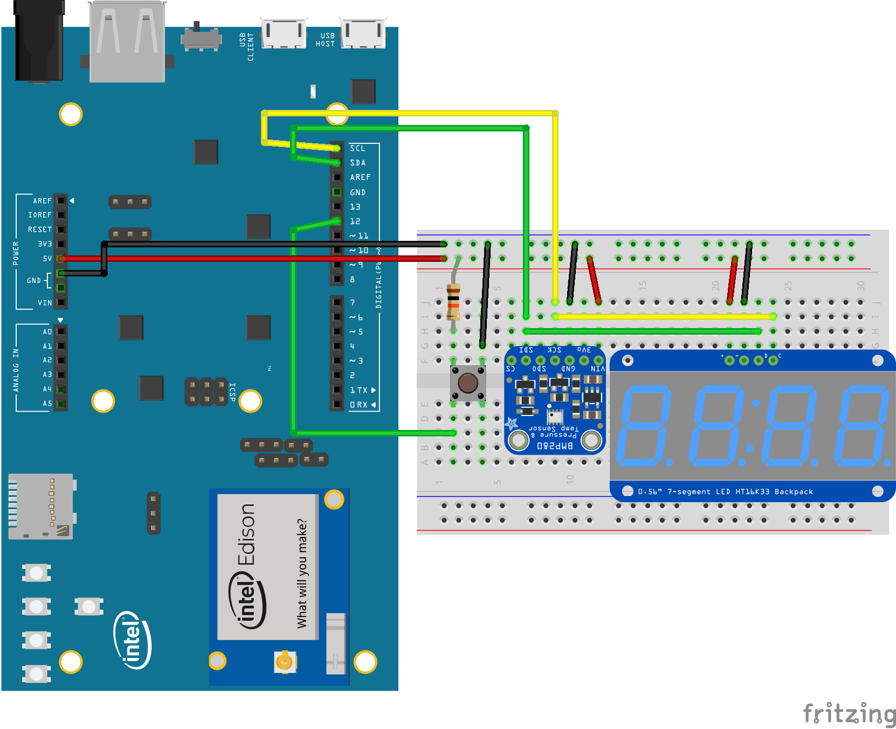
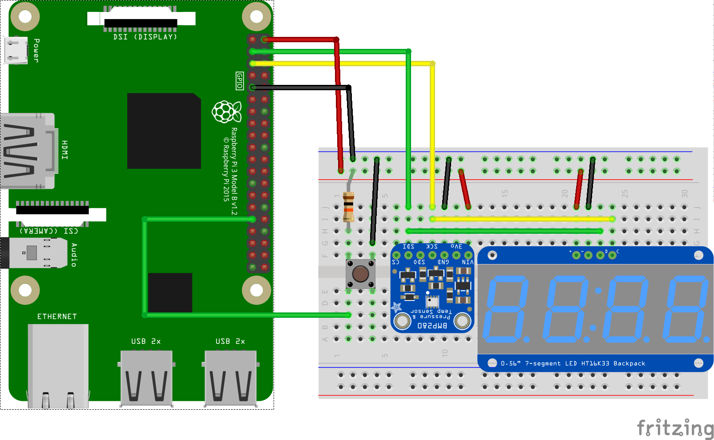

Android Things Weather Station sample
=====================================

This sample shows integration of multiple Android Things peripheral to build a connected Weather Station.

Pre-requisites
--------------
- Android Things compatible board
- Android Studio 2.2+
- 1 [bmp280 temperature sensor](https://www.adafruit.com/product/2651)
- 1 [segment display with I2C backpack](https://www.adafruit.com/product/1270)
- 1 push button
- 1 resistor
- jumper wires
- 1 breadboard
- (optional) 1 [apa102 compatible RGB Led strip](https://www.adafruit.com/product/2241)
- (optional) 1 [Piezo Buzzer](https://www.adafruit.com/products/160)
- (optional) [Google Cloud Platform](https://cloud.google.com/) project

Schematics
----------



Google Cloud Platform configuration (optional)
==============================================
0. Go to your project in the [Google Cloud Platform console](https://console.cloud.google.com/)
0. Under *API Manager*, enable the following APIs: Cloud Pub/Sub
0. Under *IAM & Admin*, create a new Service Account, provision a new private key and save the generated json credentials.
0. Under *Pub/Sub*: create a new topic and in the *Permissions* add the service account created in the previous step with the role *Pub/Sub Publisher*.
0. Import the project into Android Studio. Add a file named `credentials.json` inside `app/src/main/res/raw/` with the contents of the credentials you downloaded in the previous steps.
0. In `app/build.gradle`, replace the `buildConfigField` values with values from your project setup.

If there is no `credentials.json` file in `app/src/main/res/raw`, the app will
run offline and will not send sensor data to the Google Cloud PubSub project.

Build and install
=================
On Android Studio, click on the "Run" button.
If you prefer to run on the command line, type
```bash
./gradlew installDebug
adb shell am start com.example.androidthings.weatherstation/.WeatherStationActivity
```

Next steps
==========

If you set up the Google Cloud PubSub project, the weather sensor data is
continuously being published to your [Cloud Pub/Sub](https://cloud.google.com/pubsub/) project.

Now you can:
- process weather data with [Cloud Dataflow](https://cloud.google.com/dataflow/) or [Cloud Functions](https://cloud.google.com/functions/)
- persist weather data in [Cloud Bigtable](https://cloud.google.com/bigtable/) or [BigQuery](https://cloud.google.com/bigquery/)
- create some weather visualization with [Cloud Datalab](https://cloud.google.com/datalab/)
- build weather prediction model with [Cloud Machine Learning](https://cloud.google.com/ml/)

License
-------
Copyright 2016 The Android Open Source Project, Inc.
Licensed to the Apache Software Foundation (ASF) under one or more contributor
license agreements.  See the NOTICE file distributed with this work for
additional information regarding copyright ownership.  The ASF licenses this
file to you under the Apache License, Version 2.0 (the "License"); you may not
use this file except in compliance with the License.  You may obtain a copy of
the License at
  http://www.apache.org/licenses/LICENSE-2.0
Unless required by applicable law or agreed to in writing, software
distributed under the License is distributed on an "AS IS" BASIS, WITHOUT
WARRANTIES OR CONDITIONS OF ANY KIND, either express or implied.  See the
License for the specific language governing permissions and limitations under
the License.
